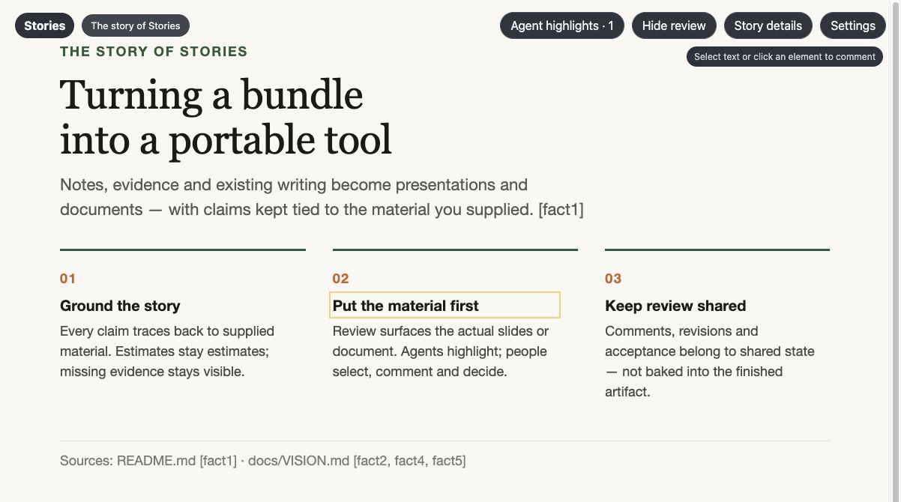

# Stories

**Turn source material into stories people can use.**



Stories helps you and your agent turn notes, evidence and existing writing into
presentations, documents and storyboards. Describe who you are writing for and what they need
to understand. Stories plans, writes and reviews a draft, keeping its claims tied
to the material you supplied.

Review the actual slides or document in a local workspace. Your agent can highlight
something worth your attention, and you can select text or an element to leave a
comment. Stories can answer or revise directly while you keep reading. Comments
stay outside the finished document, and you choose when to open a new version.

## Quick start: bring your material to your agent

Give your coding agent this message, replacing the example with your own brief:

> Use [Stories](https://github.com/robotdad/amplifier-smart-tool-stories) to turn
> the project notes I provide into a short presentation for engineering leaders.
> Install Stories and read `stories --help` for its operating skill, then read
> the help for each command you need. Help me configure a provider, keep claims
> grounded in the supplied notes, and open the draft for review. Enable a bounded
> round of comment-driven refinement.

Your agent installs and runs the tool, supplies your material, and opens the review
workspace. You can also ask for a document, an executive brief, release notes, a
case study or an explanation of measurements. No repository checkout is needed to
use Stories.

For a storyboard, you can start with a rough idea, develop an outline and add
supplied images as the sequence takes shape. Ask to explore alternatives when you
want two different approaches; ordinary creation develops one direction. Compare
them side by side, focus either for comments, and explicitly choose one to continue.
Export a ZIP to keep the structured panels, brief, HTML viewer and image files
together. This first implementation supports up to eight panels per direction;
image generation and finished video production are separate capabilities.

### Before your first story

Use a coding agent that can install and run local tools and open a browser for the
optional workspace. Stories requires Python 3.12+, Git and uv. Creating and reviewing
generated artifacts also requires Pango for text layout. Your agent can follow the
[setup instructions](src/amplifier_smart_tool_stories/SMART_TOOL.md#install-and-prerequisites).
The current implementation is validated on macOS.

Stories uses **Amplifier Agent** and needs its own configured model access. Your
coding agent’s model access is not automatically shared with it. OpenAI, Anthropic,
Gemini, ChatGPT and GitHub Copilot are supported; use a model with image input and
tool calling for artifact generation. Ask your agent to configure the provider and
prepare its runtime. Complete any required sign-in yourself. The workspace also
provides provider settings, model discovery and connection testing.

Generation sends the supplied story context and rendered review images to the
selected provider. Reading retained work, leaving agent highlights and recording
acceptance do not require a model. Source material is supplied explicitly; Stories
does not currently crawl repositories or websites for it.

### For the agent receiving this link

Install without cloning the repository:

```sh
uv tool install "amplifier-smart-tool-stories @ git+https://github.com/robotdad/amplifier-smart-tool-stories"
stories --help
```

Read `stories <command> --help` before invoking a capability. Both `--help` and `-h`
print operating skills with inputs, examples, results and recovery guidance.
The [caller guide](docs/USAGE.md) covers the library, CLI and provider setup.

## What the loop looks like

1. **Bring the evidence.** Supply source text and distinguish original material from
   summaries, hypotheses and preferences. Describe the audience and purpose.
2. **Read a draft.** Stories creates slides or a document and reviews the sources
   and rendered pages. Missing information and review limits remain inspectable.
3. **Comment and refine.** Select material or comment on the whole story. With
   authorized model work available, Stories can answer, revise or ask a question.
   Your agent can retrieve the same feedback and resulting versions later.
4. **Accept and export.** Accept a specific revision when you are satisfied. Export
   presentations as HTML or a ZIP with media assets, or documents as HTML, PDF or editable Word. Acceptance
   stays separate from model checks and does not publish anything.

Documents offer continuous reading, optional pages and zoom through a small
**View & comments** tab. Comments float without moving the material. New versions
arrive without replacing the one you are reading or discarding a saved draft.
Story details includes sources, review findings, calculations and material changes.

The workspace can act on submitted comments within its allowance, but it does not
wake the calling agent automatically. Closing its browser tab does not stop the
service; ask your agent to stop it when finished. Retained work remains available.

## What to expect

The image above is a real screenshot of Stories reviewing a presentation it generated
about its own development. [Image provenance](docs/images/README.md) describes the sources.

Stories is an early implementation. Generation time and quality depend on the
material and model. It checks source quotations and supported arithmetic, and uses
model review for factual interpretation and rendered quality. Those checks can miss
problems; review the result before relying on it.

Presentations can include supplied images and video. Keep images unchanged, explicitly
resize a copy, or export HTML with separate media in a ZIP; video uses ZIP delivery.

Documents currently support headings, paragraphs, lists, quotations and tables.
Imported HTML may preview differently when it depends on scripts or external assets.
Word wrapping and pagination can differ from the HTML review; inspect the exported
file when its layout matters. Spreadsheet work and faithful PowerPoint export are
parked.

The [storytelling coverage](docs/STORYTELLING.md) explains the writing approaches
adapted from the reference bundle and their limits. The [vision](docs/VISION.md)
and [contracts](contracts/) describe the broader intent and behavioral requirements.

## Developing or contributing?

Clone the repository when you want to work on Stories itself.
[`AGENTS.md`](AGENTS.md) covers checkout setup, architecture, validation and the
contribution workflow. Agent callers should start with the installed help.

Static presentations can also be exported as silent MP4 video through your agent,
with an explicit duration for each slide. This requires ffmpeg and ffprobe, retains
the original images, and adds no voiceover. Embedded clips and animation are not
yet supported in video exports.
